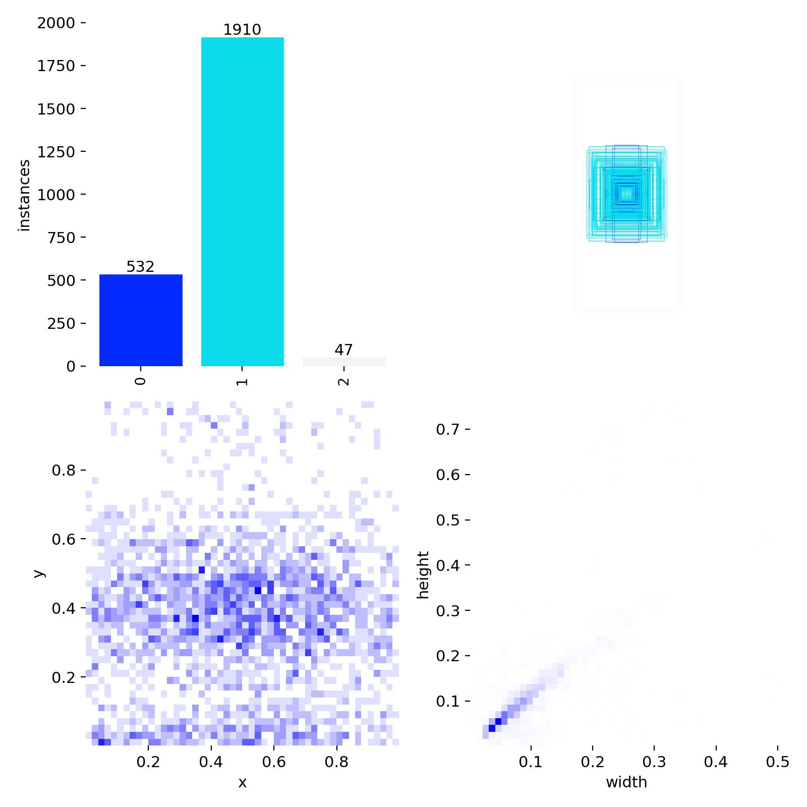
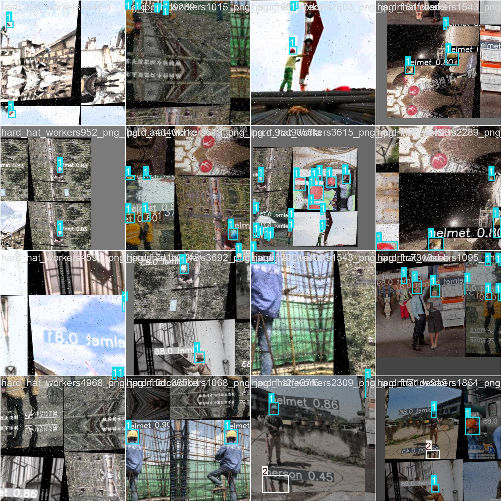
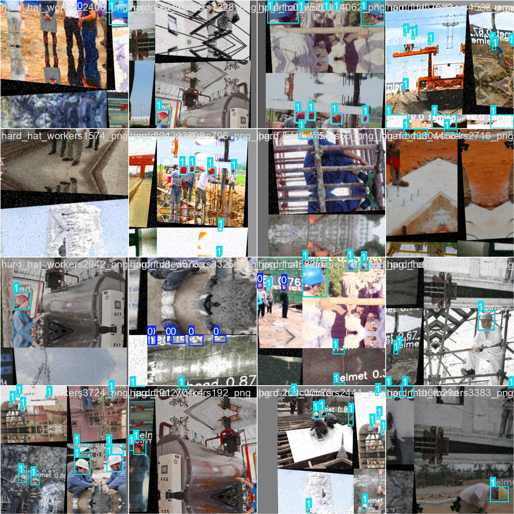

#  Sistema de Detección Automática de Cascos de Seguridad con YOLOv8

Integrantes:
*Roberto Gael Lopez Andrade
*Diego Emmanuel Barragan Garcia
/////////////////////////////////////////////////////////////////////////////////////////////////////////////////////////////////////////////////////
Este proyecto implementa un modelo de visión artificial basado en **YOLOv8** para automatizar la detección de equipo de protección personal (EPP), 
específicamente **cascos de seguridad**, en entornos industriales o de construcción. 

El sistema clasifica e identifica tres clases principales:
* `con_casco` (Workers wearing safety helmets)
* `sin_casco` (Workers without safety helmets)
* `persona`
/////////////////////////////////////////////////////////////////////////////////////////////////////////////////////////////////////////////////////////
## Estructura del Proyecto

* **`codigo_fuente/`**: Scripts de Python para la descarga del dataset, entrenamiento del modelo e inferencia.
* **`evidencias/`**: Imágenes de pruebas reales exitosas.
* **`requirements.txt`**: Librerías necesarias para replicar el entorno de desarrollo.

/////////////////////////////////////////////////////////////////////////////////////////////////////////////////////////////////////////////////////////

## Entrenamiento y Dataset

* **Dataset:** Se utilizó un dataset hospedado en Roboflow (`safety-helmet-817ux`) con imágenes pre-etiquetadas de trabajadores en obras.
* **Arquitectura Base:** YOLOv8 Nano (`yolov8n.pt`) para balancear velocidad de procesamiento y precisión.
* **Configuración:**
  * Épocas: 20
  * Tamaño de imagen: 640x640 píxeles
  * Umbral de confianza (Confidence Threshold): 0.40
 
//////////////////////////////////////////////////////////////////////////////////////////////////////////////////////////////////////////////////////////
##  Instalación y Uso

1. **Clonar el repositorio** desde GitHub:
```bash
git clone https://github.com/23310290diego/Proyecto-Visi-n-Artificial.git


 ``` 
2.Entra a la carpeta del proyecto que se acaba de descargar

 ``` 
 cd Proyecto-Visi-n-Artificial

``` 
 3.Instala las dependencias (las librerías de IA) leyendo el archivo de requerimientos:
 ``` 
 pip install -r requirements.txt
 
 ``` 
 
4.Ejecuta la detección de cascos sobre una imagen de prueba
``` 
 
python codigo_fuente/detectar_cascos.py personas_con_casco.jpg
``` 
5.Ve los resultados finales con los cascos detectados en la ruta
 ```
runs/detect/predict/
```


##  Gráficas y Lotes de Entrenamiento (Evidencias)

A continuación se muestran los resultados obtenidos durante el proceso de entrenamiento del modelo YOLOv8:






